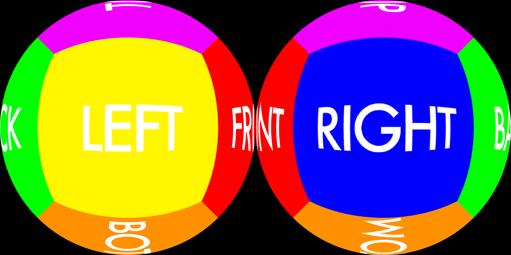

# Panoramic, Fisheye, and Cubemap 2D and 3D Video
## Shader
This Skybox Shader is based on Unity's built-in shader, which can display 180 and 360 degree videos in either equirectangular (latitude longitude) or cubemap (6 frames) layouts as a scene backdrop.
This shader adds an additional fisheye projection, which currently can display 3D 180 degree videos given an input frame that looks like this:

(Image source: https://github.com/bhautikj/vrProjector)

A video in one of these formats can be played by the Video Player component and output to a Render Texture (ideally of the exact same resolution). That texture can then be fed to the Shader for proper mapping onto the scene’s Skybox.

## 3D 180/360 Content
When Player Settings include “Virtual Reality Support”,  the Skybox Panoramic Shader also offers 3D (stereo) support for 360/180 degree content. The right and left eye content are taken either from the right and left sides of the video by setting the shader options to Side by Side, or, from the top and bottom of the video with the Over Under option.

## Documentation
Detailed instructions on how to use this shader are available [here](https://docs.google.com/document/d/1JjOQ0dXTYPFwg6eSOlIAdqyPo6QMLqh-PETwxf8ZVD8)

## Feedback and Bug Reporting
Until this feature is officially shipped, please submit your feedback in [this thread in the Unity VR forum](https://forum.unity3d.com/threads/how-to-integrate-360-video-with-unity.485405/)

## TODO:
+ Comment on algorithm
+ Improve to use both 2d and 3d images, either side-by-side or over/under
+ Update deprecated player settings issue
+ Remove other projection code
+ Create auto-calibrator
+ Create secondary skybox webcam dropdown (update webcam script)
+ Create calibration save file
+ Reduce vars (condense into 2d points)
+ Use PTGui settings
+ Create usage documentation
+ Optimize code (remove duplicate code in stereo eye index if statement)
+ Add valid fallback shader
+ Remove looping y-data, create dynamic image limits

## Additional references
The scripts used in this shader come from the following sources:
+ https://github.com/greggman/fisheye-skybox-unity/blob/master/Assets/Shaders/Skybox-Panoramic-Gman.shader
+ https://stackoverflow.com/questions/60828221/making-a-fisheye-skybox-shader-in-unity
